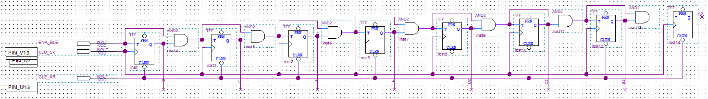
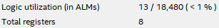
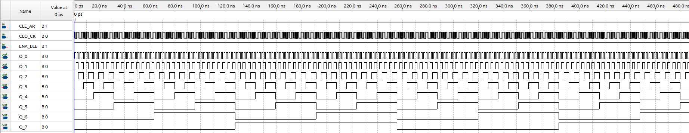
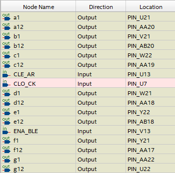
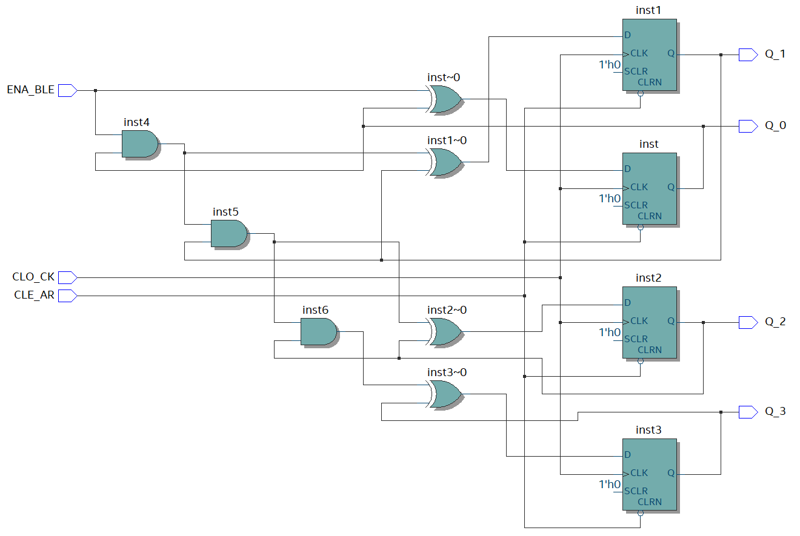
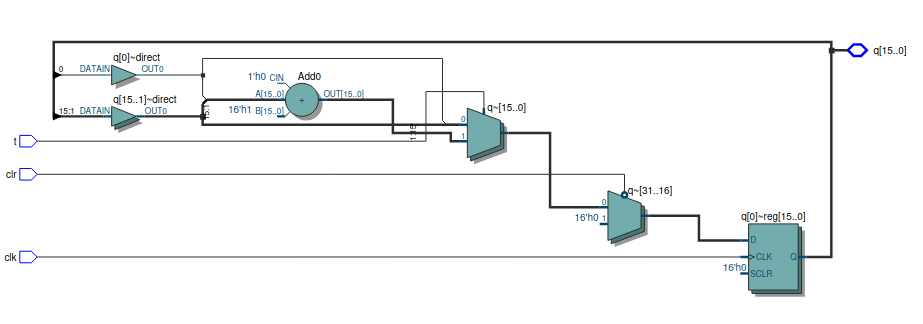

# SSC0108 - Prática-SD

[Laboratory Exercise 4 - Counters](src/)

### Alunos

|        Nome                         |    NUSP   |       
|:-----------------------------------:|:---------:|  
|   Laura Fernandes Camargos          |  13692334 |   
|   Sandy da Costa Dutra       	      |  12544570 |   
|   Vitor Nishimura		                |  5255289  | 

# Softwares utilizados

Quartus Prime 21.1 <br>

## Part I
### 1. 
Implementamos o circuito com portas lógicas e geramos o arquivo vhdl a partir dele:

<div align ="center">
    
</div>

Captura de tela durante a compilação do circuito que mostra quantos elementos lógicos e quantos registradores são utilizados:

<div align ="center">
    
</div>


[Link para o projeto implementado no Quartus](quartus/part1/)

### 2.


### 3.
<div align ="center">
    
</div>

### 4.
Mostrado durante a apresentação no laboratório.

### 5. 
<div align ="center">
    
</div>

A diferença observada na implementação de um circuito de 4 bits no Quartus em comparação com o circuito original da Figura 1 é que, no RTL Viewer, o software Quartus utiliza flip-flops do tipo D para realizar a síntese do contador síncrono de 4 bits. Os flip-flops tipo D são comumente usados para armazenar e controlar o estado de um contador síncrono, garantindo que a transição de um estado para o próximo ocorra de forma precisa a cada pulso de clock. Isso difere do que pode ser mostrado na Figura 1, pois embora ambos possam implementar o contador síncrono de 4 bits, o Quartus, ao sintetizar o circuito, usa flip-flops tipo D, pois são mais comuns em FPGAs. Já a Figura 1, ao usar flip-flops tipo T, representa uma forma diferente de projetar o contador, mas ambos alcançam o mesmo resultado lógico.
	
## Part II

### Codigo VHDL:

```
LIBRARY IEEE;
USE IEEE.STD_LOGIC_1164.ALL;
USE IEEE.NUMERIC_STD.ALL;

ENTITY contador16b IS
    PORT (
        CLK : IN STD_LOGIC;
        T   : IN STD_LOGIC;
        Q   : OUT STD_LOGIC_VECTOR(15 DOWNTO 0);
        CLR : IN STD_LOGIC
    );
END CONTADOR16B;

ARCHITECTURE BEHAVIORAL OF contador16b IS
    SIGNAL count : UNSIGNED(15 DOWNTO 0);
BEGIN
    PROCESS (CLK, CLR)
    BEGIN
        IF CLR = '0' THEN
            count <= (OTHERS => '0'); -- Reset the count
        ELSIF RISING_EDGE(CLK) THEN
            IF T = '1' THEN
                count <= count + 1;
            END IF;
        END IF;
    END PROCESS;
    
    Q <= STD_LOGIC_VECTOR(count);
END BEHAVIORAL;

```
<div align ="center">
    
</div>

[Link para o projeto implementado no Quartus](quartus/part2/)

## Part III

### Codigo VHDL:

```
library ieee;
use ieee.std_logic_1164.all;
use ieee.std_logic_unsigned.all;
use ieee.std_logic_arith.all;

entity DisplayController is
    port (
        clk     : in std_logic;
        rst     : in std_logic;
		  enb     : in std_logic;
        seg     : out std_logic_vector(6 downto 0)  -- 7-segment display output
    );
end DisplayController;

architecture Behavioral of DisplayController is
    signal tick       : std_logic := '0';
    signal sec_counter: std_logic_vector(25 downto 0) := (others => '0');
    signal digit      : std_logic_vector(3 downto 0) := (others => '0');
begin

    -- 1-second timer
    process (clk, rst)
    begin
        if rst = '1' then
            sec_counter <= (others => '0');
            tick <= '0';
        elsif rising_edge(clk) and enb = '1' then
            if sec_counter = "10111110101100100000000000" then
                sec_counter <= (others => '0');
                tick <= '1';
            else
                sec_counter <= sec_counter + 1;
                tick <= '0';
            end if;
        end if;
    end process;

    -- 4-bit counter
    process (clk, rst)
    begin
        if rst = '1' then
            digit <= (others => '0');
        elsif rising_edge(clk) and enb = '1' then
            if tick = '1' then
                if digit = "1001" then
                    digit <= (others => '0');
                else
                    digit <= digit + 1;
                end if;
            end if;
        end if;
    end process;

    -- 7-segment display decoder
    process (digit)
    begin
        case digit is
            when "0000" => seg <= "0000001"; -- 0
            when "0001" => seg <= "1001111"; -- 1
            when "0010" => seg <= "0010010"; -- 2
            when "0011" => seg <= "0000110"; -- 3
            when "0100" => seg <= "1001100"; -- 4
            when "0101" => seg <= "0100100"; -- 5
            when "0110" => seg <= "0100000"; -- 6
            when "0111" => seg <= "0001111"; -- 7
            when "1000" => seg <= "0000000"; -- 8
            when "1001" => seg <= "0000100"; -- 9
            when others => seg <= "1111111"; -- Display nothing
        end case;
    end process;

end Behavioral;
```
[Link para o projeto implementado no Quartus](quartus/part3/)


## Part IV
Como usamos a FPGA DEO-CV (placa pequena), a palavra é a ser rotacionada nos 4 displays deve ser dE0:

| Count | Characters   |
|-------|--------------|
| 00    | d E 0        |
| 01    | E 0 d        |
| 10    | 0 d E        |
| 11    | d E 0        |


### Codigo VHDL:

```
library ieee;
use ieee.std_logic_1164.all;
use ieee.std_logic_unsigned.all;
use ieee.std_logic_arith.all;

entity DisplayController is
    port (
        clk     : in std_logic;
        rst     : in std_logic;
		  enb     : in std_logic;
        seg     : out std_logic_vector(27 downto 0)  -- 7-segment display output

    );
end DisplayController;

architecture Behavioral of DisplayController is
    signal tick       : std_logic := '0';
    signal sec_counter: std_logic_vector(25 downto 0) := (others => '0');
    signal digit      : std_logic_vector(1 downto 0) := (others => '0');
begin

    -- 1-second timer
    process (clk, rst)
    begin
        if rst = '1' then
            sec_counter <= (others => '0');
            tick <= '0';
        elsif rising_edge(clk) and enb = '1' then
            if sec_counter = "10111110101100100000000000" then
                sec_counter <= (others => '0');
                tick <= '1';
            else
                sec_counter <= sec_counter + 1;
                tick <= '0';
            end if;
        end if;
    end process;

    -- 2-bit counter
    process (clk, rst)
    begin
        if rst = '1' then
            digit <= (others => '0');
        elsif rising_edge(clk) and enb = '1' then
            if tick = '1' then
                if digit = "11" then
                    digit <= (others => '0');
                else
                    digit <= digit + 1;
                end if;
            end if;
        end if;
    end process;

    -- 7-segment display decoder
    process (digit)
    begin
        case digit is
				when "00" => seg <= "0000001011000010000101111111"; -- 0ed_
				when "01" => seg <= "1111111000000101100001000010"; -- _0ed
				when "10" => seg <= "1000010111111100000010110000"; -- d_0e
				when "11" => seg <= "0110000100001011111110000001"; -- ed_0
				when others => seg <= (others => '0'); -- default to all segments off (if needed)
        end case;
		  -- _ = "1111111"
		  -- e = "0110000"
		  -- d = "1000010"
		  -- 0 = "0000001"
    end process;

end Behavioral;
```
[Link para o projeto implementado no Quartus](quartus/part4/)

## Part V
Como usamos a FPGA DEO-CV (placa pequena), a palavra é a ser rotacionada nos 6 displays deve ser dE0:

| Count | Character Pattern |
|-------|-------------------|
| 000   | d E 0             |
| 001   | E 0 d             |
| 010   | 0 d E             |
| 011   | d E 0             |
| 100   | E 0 d             |
| 101   | 0 d E             |


### Codigo VHDL:

```
library ieee;
use ieee.std_logic_1164.all;
use ieee.std_logic_unsigned.all;
use ieee.std_logic_arith.all;

entity DisplayController is
    port (
        clk     : in std_logic;
        rst     : in std_logic;
		  enb     : in std_logic;
        seg     : out std_logic_vector(41 downto 0)  -- 7-segment display output
    );
end DisplayController;

architecture Behavioral of DisplayController is
    signal tick       : std_logic := '0';
    signal sec_counter: std_logic_vector(25 downto 0) := (others => '0');
    signal digit      : std_logic_vector(2 downto 0) := (others => '0');
begin

    -- 1-second timer
    process (clk, rst, enb)
    begin
        if rst = '1' then
            sec_counter <= (others => '0');
            tick <= '0';
        elsif rising_edge(clk) and enb='1' then
            if sec_counter = "10111110101100100000000000" then
                sec_counter <= (others => '0');
                tick <= '1';
            else
                sec_counter <= sec_counter + 1;
                tick <= '0';
            end if;
        end if;
    end process;

    -- 2-bit counter
    process (clk, rst, enb)
    begin
        if rst = '1' then
            digit <= (others => '0');
        elsif rising_edge(clk) and enb='1' then
            if tick = '1' then
                if digit = "101" then
                    digit <= (others => '0');
                else
                    digit <= digit + 1;
                end if;
            end if;
        end if;
    end process;

    -- 7-segment display decoder
    process (digit)
    begin
        case digit is
				when "000" => seg <= "000000101100001000010111111111111111111111"; -- 0ed___
				when "001" => seg <= "111111100000010110000100001011111111111111"; -- _0ed__
				when "010" => seg <= "111111111111110000001011000010000101111111"; -- __0ed_
				when "011" => seg <= "111111111111111111111000000101100001000010"; -- ___0ed
				when "100" => seg <= "100001011111111111111111111100000010110000"; -- d___0e
				when "101" => seg <= "011000010000101111111111111111111110000001"; -- ed___0
				when others => seg <= (others => '0'); -- default to all segments off (if needed)
        end case;
		  -- _ = "1111111"
		  -- e = "0110000"
		  -- d = "1000010"
		  -- 0 = "0000001"
    end process;

end Behavioral;

```
[Link para o projeto implementado no Quartus](quartus/part5/)
