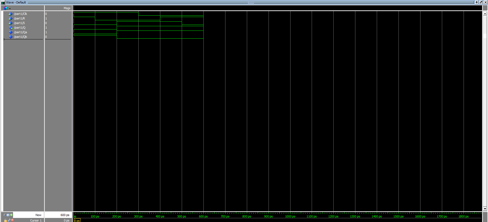
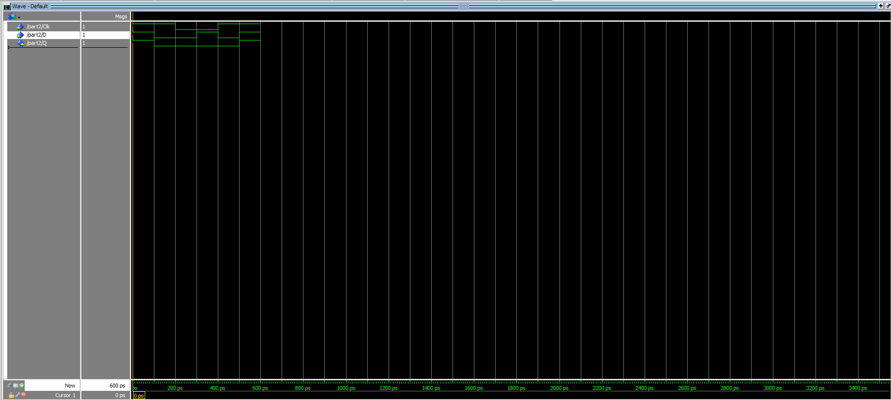
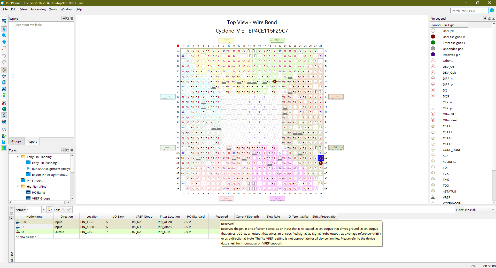
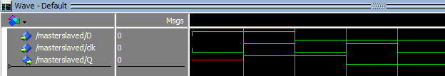
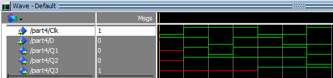

# SSC0108 - Prática-SD

[Projeto 1: Latches, Flip-flops, and Registers.](src/lab3.pdf)

### Alunos

|        Nome                         |    NUSP   |       
|:-----------------------------------:|:---------:|  
|   Laura Fernandes Camargos          |  13692334 |   
|   Sandy da Costa Dutra       	      |  12544570 |   
|   Vitor Nishimura		      |           | 

# Softwares utilizados

Versão do Quartus: Quartus Prime 21.1 <br>
Versão ModelSim: ModelSim - Intel FPGA Starter Edition 10.5b <br>

## Part I

RTL Viewer:

[PDF da Part I](src/RTL_viewer.pdf)

Technology Map Viewer:

[PDF da Part I](src/post_fitting.pdf)

Gráfico de ondas da simulação(Modelsim):

<div align ="center">
    
</div>

Codigo VHDL:

```
LIBRARY ieee;
USE ieee.std_logic_1164.all;

ENTITY part1 IS
 PORT ( Clk, R, S : IN STD_LOGIC;
	Q : OUT STD_LOGIC);
END part1;


ARCHITECTURE Structural OF part1 IS
 SIGNAL R_g, S_g, Qa, Qb : STD_LOGIC ;
 ATTRIBUTE KEEP : BOOLEAN;
 ATTRIBUTE KEEP OF R_g, S_g, Qa, Qb : SIGNAL IS TRUE;
BEGIN
 R_g <= R AND Clk;
 S_g <= S AND Clk;
 Qa <= NOT (R_g OR Qb);
 Qb <= NOT (S_g OR Qa);
 Q <= Qa;
END Structural;

```
[Link para os arquivos usados no Quartus](C%C3%B3digos-Quartus/part1.zip)
	
## Part II

RTL Viewer:

[PDF da Part II](src/rtl_part2.pdf)

Technology Map Viewer:

[PDF da Part II](src/tech_viewer_part2.pdf)

Gráfico de ondas da simulação(Modelsim):

<div align ="center">
    
</div>

Configuração dos pinos da placa DE2-115 para simulação(Quartus):
<div align ="center">
    
</div>

Codigo VHDL:

```
LIBRARY ieee;
USE ieee.std_logic_1164.all; 

LIBRARY work;

ENTITY latchD IS 
	PORT
	(
		D :  IN  STD_LOGIC;
		CLK :  IN  STD_LOGIC;
		Qa :  OUT  STD_LOGIC
	);
END latchD;

ARCHITECTURE bdf_type OF latchD IS 

SIGNAL	SYNTHESIZED_WIRE_0 :  STD_LOGIC;
SIGNAL	SYNTHESIZED_WIRE_1 :  STD_LOGIC;
SIGNAL	SYNTHESIZED_WIRE_2 :  STD_LOGIC;
SIGNAL	SYNTHESIZED_WIRE_3 :  STD_LOGIC;
SIGNAL	SYNTHESIZED_WIRE_4 :  STD_LOGIC;


BEGIN 
Qa <= SYNTHESIZED_WIRE_4;


SYNTHESIZED_WIRE_2 <= NOT(CLK AND D);


SYNTHESIZED_WIRE_3 <= NOT(SYNTHESIZED_WIRE_0 AND CLK);


SYNTHESIZED_WIRE_4 <= NOT(SYNTHESIZED_WIRE_1 AND SYNTHESIZED_WIRE_2);


SYNTHESIZED_WIRE_1 <= NOT(SYNTHESIZED_WIRE_3 AND SYNTHESIZED_WIRE_4);


SYNTHESIZED_WIRE_0 <= NOT(D);


END bdf_type;

```
[Link para os arquivos usados no Quartus](C%C3%B3digos-Quartus/part2,3,4.zip)

## Part III

RTL Viewer:

[PDF da Part III](src/rtl_part3.pdf)


Technology Map Viewer:

[PDF da Part III](src/tech_viewer_part3.pdf)

Gráfico de ondas da simulação(Modelsim):

<div align ="center">
    
</div>

Codigo VHDL:

```
LIBRARY ieee;
USE ieee.std_logic_1164.all; 

LIBRARY work;

ENTITY masterslaveD IS 
	PORT
	(
		D :  IN  STD_LOGIC;
		clk :  IN  STD_LOGIC;
		Q :  OUT  STD_LOGIC
	);
END masterslaveD;

ARCHITECTURE bdf_type OF masterslaveD IS 

COMPONENT latchd
	PORT(D : IN STD_LOGIC;
		 CLK : IN STD_LOGIC;
		 Qa : OUT STD_LOGIC
	);
END COMPONENT;

SIGNAL	SYNTHESIZED_WIRE_0 :  STD_LOGIC;
SIGNAL	SYNTHESIZED_WIRE_1 :  STD_LOGIC;


BEGIN 


b2v_inst : latchd
PORT MAP(D => D,
		 CLK => SYNTHESIZED_WIRE_0,
		 Qa => SYNTHESIZED_WIRE_1);


b2v_inst1 : latchd
PORT MAP(D => SYNTHESIZED_WIRE_1,
		 CLK => clk,
		 Qa => Q);


SYNTHESIZED_WIRE_0 <= NOT(clk);


END bdf_type;

```
[Link para os arquivos usados no Quartus](C%C3%B3digos-Quartus/part2,3,4.zip)


## Part IV

RTL Viewer:

[PDF da Part IV](src/rtl_4.pdf)

Technology Map Viewer:

[PDF da Part IV](src/map_4.pdf)

Gráfico de ondas da simulação(Modelsim):

<div align ="center">
    
</div>

Codigo VHDL Principal:

```
LIBRARY ieee ;
USE ieee.std_logic_1164.all ;
ENTITY part4 IS
PORT ( D, Clk : IN STD_LOGIC ;
Q1,Q2,Q3 : OUT STD_LOGIC) ;
END part4 ;
ARCHITECTURE Behavior OF part4 IS
BEGIN
PROCESS ( D, Clk )
BEGIN
IF Clk = '1' THEN
Q1 <= D ;
END IF ;
IF rising_edge(Clk) THEN
Q2 <= D ;
END IF ;
IF falling_edge(Clk) THEN
Q3 <= D ;
END IF ;
END PROCESS ;
END Behavior ;

```
[Link para os arquivos usados no Quartus](C%C3%B3digos-Quartus/part2,3,4.zip)
