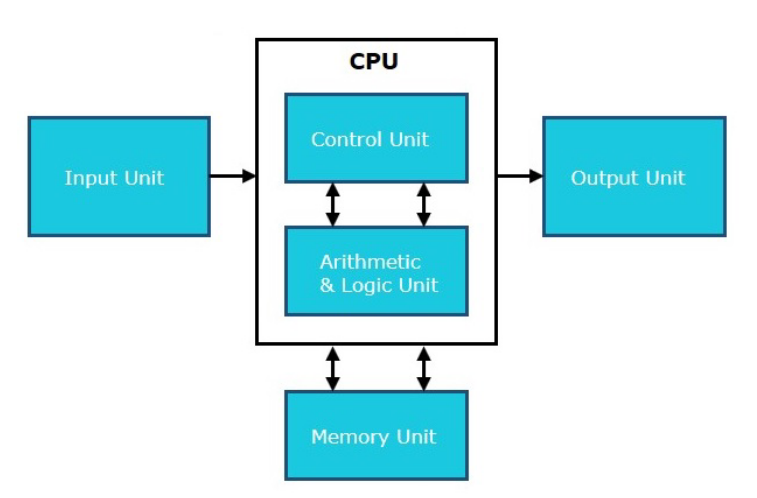
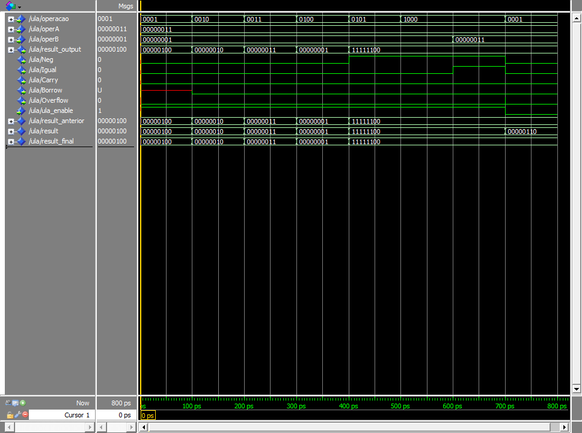

# SSC0108 - Projeto Final 
O objetivo desse projeto é desenvolver em VHDL um processador digital simples segundo as
especificações contidas neste [documento](img/TrabalhoFinalPráticaSistemasDigitais-2.pdf). O desenvolvimento da CPU deve ser capaz de realizar operações aritméticas, lógicas, de controle de fluxo e de entrada/saída com a placa FPGA, utilizando uma arquitetura básica composta por barramentos e componentes internos, como ULA, Unidade de Controle e Unidade de Memória.

### Alunos

|        Nome                         |    NUSP   |       
|:-----------------------------------:|:---------:|  
|   Laura Fernandes Camargos          |  13692334 |   
|   Sandy da Costa Dutra       	      |  12544570 |   
|   Vitor Nishimura		              |  5255289  | 

## Instruções

As instruções que o processador executa são: 

- **ADD Reg1, Reg2:** Soma valores de Reg1 e Reg2, armazena o resultado em R.

- **SUB Reg1, Reg2:** Subtrai Reg2 de Reg1, armazena o resultado em R.

- **AND Reg1, Reg2:** Realiza operação AND entre Reg1 e Reg2, armazena o resultado em R.

- **OR Reg1, Reg2:** Realiza operação OR entre Reg1 e Reg2, armazena o resultado em R.

- **NOT Reg1:** Inverte os bits de Reg1, armazena o resultado em R.

- **CMP Reg1, Reg2:** Compara Reg1 e Reg2, atualizando os registradores de flags.

- **JMP addr:** Salta para o endereço addr.

- **JEQ addr:** Salta para addr se o último resultado comparado for igual.

- **JGR addr:** Salta para addr se o último resultado comparado for maior.

- **LOAD Reg1, addr:** Carrega o valor do endereço addr para Reg1.

- **STORE Reg1, addr:** Armazena o valor de Reg1 no endereço addr.

- **MOV Reg1, Reg2:** Move o valor de Reg2 para Reg1.

- **IN Reg1:** Lê o valor das chaves do FPGA e armazena em Reg1

Cada instrução (linha) contida no arquivo .mif da memória possui 8 bits e apenas 3 registradores de manipulação (A,B,R), logo a interpretação da instrução ocorre da seguinte maneira:

|        op_code                      |    reg_selecionado   |       
|:-----------------------------------:|:--------------------:|  
|             0000                    |         0000         |   

Sendo op_code: código da instrução e reg_ selecionado: operadores A e B da instrução.

### Code das intruções:

| Instrução | Código Binário | Tipo             |
|:---------:|:--------------:|:----------------:|
| ADD       | 0001           | Aritmética       |
| SUB       | 0010           | Aritmética       |
| AND       | 0011           | Aritmética       |
| OR        | 0100           | Lógica           |
| NOT       | 0101           | Lógica           |
| CMP       | 1000           | Lógica           |
| JMP       | 1011           | Controle de fluxo|
| JEQ       | 1100           | Controle de fluxo|
| JGR       | 1101           | Controle de fluxo|
| LOAD      | 1001           | Memória          |
| STORE     | 1010           | Memória          |
| MOV       | 1110           | Memória          |
| IN        | 0110           | Entrada          |
| OUT       | 0111           | Saída            |
| WAIT      | 1111           | Controle de fluxo|

### Code dos registradores

| Registrador | Código Binário |
|:-----------:|:--------------:
|
| A           | 00             |
| B           | 01             |
| R           | 10             |
| I           | 11             |

Importante ressaltar que no caso de instruções que envolvem valores imediatos (ADD A 255), é preciso usar duas instruções, uma vez que a memória possui 8 bits de endereçamento e o valor imediato também possui 8 bits.

## Componentes Internos
A arquitetura do processador é composta por quatro elementos fundamentais: os registradores, que armazenam temporariamente dados e instruções; a memória, responsável por guardar informações que o processador consiga acessar; a unidade de controle (UC), que decodifica as operações e interpreta as instruções; e a unidade lógica e aritmética (ULA), que executa operações matemáticas e operações lógicas.

Diagrama que ilustra a configuração geral do processador, mostrando a integração entre seus componentes internos:

    

## Simulação ULA:

    

Nessa simulação é possível observar o comportamento de todas as intruções da ULA, respeitando a atualização da flag ula_enable, não atualizando o resultado do output.

