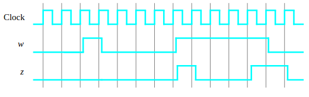
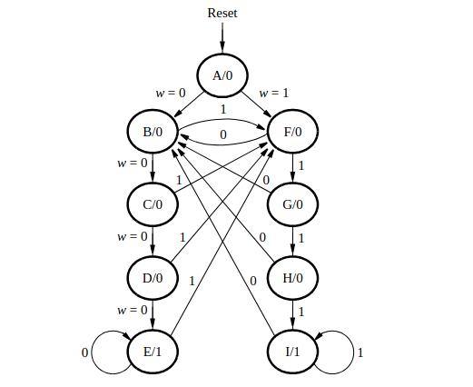

# SSC0108 - Prática-SD

[Laboratory Exercise 7 - Finite State Machines](img/lab7%20[PART%20I%20e%20PART%20IV].pdf)

### Alunos

|        Nome                         |    NUSP   |       
|:-----------------------------------:|:---------:|  
|   Laura Fernandes Camargos          |  13692334 |   
|   Sandy da Costa Dutra       	      |  12544570 |   
|   Vitor Nishimura		                |  5255289  | 

# Softwares utilizados

Quartus Prime 21.1 <br>

## Part I
Desejamos implementar uma máquina de estados finitos (FSM) que reconheça duas sequências específicas de símbolos de entrada aplicados, a saber, quatro 1s consecutivos ou quatro 0s consecutivos. Existe uma entrada w e uma saída z. Sempre que w=1 ou w=0 por quatro pulsos de clock consecutivos, o valor de z deve ser 1; caso contrário, z=0. Sequências sobrepostas são permitidas, de modo que, se w=1 por cinco pulsos de clock consecutivos, a saída z será igual a 1 após o quarto e quinto pulsos. A Figura abaixo ilustra a relação necessária entre w e z.

<div align ="center">
    
</div>      

Um diagrama de estados para essa FSM:
<div align ="center">
    
</div>

One-hot codes for the FSM - Tabela 1:
| State Name | y8 y7 y6 y5 y4 y3 y2 y1 y0 |
|------------|----------------------------|
| A          | 000000001                  |
| B          | 000000010                  |
| C          | 000000100                  |
| D          | 000001000                  |
| E          | 000010000                  |
| F          | 000100000                  |
| G          | 001000000                  |
| H          | 010000000                  |
| I          | 100000000                  |

### Código VHDL que implementa o código one-hot dado na Tabela 1:
```
LIBRARY ieee;
USE ieee.std_logic_1164.ALL;

entity part1 is
    port(
        clock  : in std_logic;
        w      : in std_logic;
        reset  : in std_logic;
        z      : out std_logic;
        state   : out std_logic_vector(8 downto 0)
    );
end part1;

architecture behavior of part1 is

    type State_type is (A, B, C, D, E, F, G, H, I);
    signal y_Q, Y_D : State_type;

begin

    
    process(w, y_Q)
    begin
        case y_Q is
            when A =>
                state <= "000000001";
                z <= '0';
                if (w = '0') then
                    Y_D <= B;
                else
                    Y_D <= F; 
                end if;

            when B =>
                state <= "000000010";
                z <= '0';
                if (w = '0') then
                    Y_D <= C;
                else
                    Y_D <= F;
                end if;

            when C =>
                state <= "000000100";
                z <= '0';
                if (w = '0') then
                    Y_D <= D;
                else
                    Y_D <= F;
                end if;

            when D =>
                state <= "000001000";
                z <= '0';
                if (w = '0') then
                    Y_D <= E;
                else
                    Y_D <= F;
                end if;

            when E =>
                state <= "000010000";
                z <= '1'; 
                if (w = '0') then
                    Y_D <= E;  
                else
                    Y_D <= F;
                end if;

            when F =>
                state <= "000100000";
                z <= '0';
                if (w = '1') then
                    Y_D <= G; 
                else
                    Y_D <= B;  
                end if;

            when G =>
                state <= "001000000";
                z <= '0';
                if (w = '1') then
                    Y_D <= H;
                else
                    Y_D <= B;
                end if;

            when H =>
                state <= "010000000";
                z <= '0';
                if (w = '1') then
                    Y_D <= I;
                else
                    Y_D <= B;
                end if;

            when I =>
                state <= "100000000";
                z <= '1'; 
                if (w = '1') then
                    Y_D <= I;  
                else
                    Y_D <= B;
                end if;

            when others =>
                Y_D <= A;  
        end case;
    end process;

    
    process(clock)
    begin
        if rising_edge(clock) then
            if reset = '1' then
                y_Q <= A; 
            else
                y_Q <= Y_D;  
            end if;
        end if;
    end process;

end behavior;

```
Uma vez compilado e simulado o circuito, foi feita a configuração da FPGA Cyclone V DE0-CV para testar o circuito de fato. Foram usadas a chave de alternância SW0 como uma entrada de reset síncrona ativa em nível baixo para o FSM, o SW1 como a entrada w e o botão de pressão KEY0 como a entrada de clock, que é aplicada manualmente. O LEDR9 como a saída z e as saídas dos flip-flops de estado aos leds LEDR8 a LEDR0.    

Por fim, é feita uma modificação do código one-hot dado na Tabela 1. Muitas vezes, é desejável definir todas as saídas dos flip-flops com o valor 0 no estado de reset. A Tabela 2 mostra uma atribuição de estado one-hot modificada, na qual o estado de reset, A, usa todos os 0s. Isso é feito invertendo a variável de estado y0​. 

Tabela 2: 
| State Name | y8 y7 y6 y5 y4 y3 y2 y1 y0 |
|------------|----------------------------|
| A          | 000000000                  |
| B          | 000000011                  |
| C          | 000000101                  |
| D          | 000001001                  |
| E          | 000010001                  |
| F          | 000100001                  |
| G          | 001000001                  |
| H          | 010000001                  |
| I          | 100000001                  |


Foi criada então uma versão modificada do código VHDL que implementa essa atribuição de estado. 

### Codigo VHDL modificado:

```
LIBRARY ieee;
USE ieee.std_logic_1164.ALL;

entity part1_6 is
    port(
        clock  : in std_logic;
        w      : in std_logic;
        reset  : in std_logic;
        z      : out std_logic;
        state   : out std_logic_vector(8 downto 0) 
    );
end part1_6;

architecture behavior of part1_6 is

    type State_type is (A, B, C, D, E, F, G, H, I);
    signal y_Q, Y_D : State_type;

begin

   
    process(w, y_Q)
    begin
        case y_Q is
            when A =>
                state <= "000000000"; 
                z <= '0';
                if (w = '0') then
                    Y_D <= B; 
                else
                    Y_D <= F; 
                end if;

            when B =>
                state <= "000000011";  
                z <= '0';
                if (w = '0') then
                    Y_D <= C;
                else
                    Y_D <= F;
                end if;

            when C =>
                state <= "000000101";  
                z <= '0';
                if (w = '0') then
                    Y_D <= D;
                else
                    Y_D <= F;
                end if;

            when D =>
                state <= "000001001"; 
                z <= '0';
                if (w = '0') then
                    Y_D <= E;
                else
                    Y_D <= F;
                end if;

            when E =>
                state <= "000010001"; 
                z <= '1';  
                if (w = '0') then
                    Y_D <= E;  
                else
                    Y_D <= F;
                end if;

            when F =>
                state <= "000100001";  
                z <= '0';
                if (w = '1') then
                    Y_D <= G;  
                else
                    Y_D <= B;  
                end if;

            when G =>
                state <= "001000001"; 
                z <= '0';
                if (w = '1') then
                    Y_D <= H;
                else
                    Y_D <= B;
                end if;

            when H =>
                state <= "010000001";  
                z <= '0';
                if (w = '1') then
                    Y_D <= I;
                else
                    Y_D <= B;
                end if;

            when I =>
                state <= "100000001";  
                z <= '1';  
                if (w = '1') then
                    Y_D <= I; 
                else
                    Y_D <= B;
                end if;

            when others =>
                Y_D <= A;  
        end case;
    end process;

   
    process(clock)
    begin
        if rising_edge(clock) then
            if reset = '1' then
                y_Q <= A; 
            else
                y_Q <= Y_D; 
            end if;
        end if;
    end process;
end behavior;

```
Uma vez compilado o circuito, o mesmo foi testado novamente.

## Part IV

Nesta parte do exercício, implementamos um codificador de código Morse usando uma FSM. O código Morse utiliza padrões de pulsos curtos e longos para representar uma mensagem. Cada letra é representada como uma sequência de pontos (um pulso curto) e traços (um pulso longo). Por exemplo, as primeiras oito letras do alfabeto têm as seguintes representações:

| Letra | Código Morse    |
|-------|------------------|
| A     | • —             |
| B     | — • • •         |
| C     | — • — •         |
| D     | — • •           |
| E     | •               |
| F     | • • — •         |
| G     | — — •           |
| H     | • • • •         |

O circuito desenvolvido recebe como entrada uma das primeiras oito letras do alfabeto e exibe o código Morse correspondente em um LED. Utilizamos os switches SW2−0 e os botões KEY1−0 como entradas. Quando um usuário pressionar o botão KEY1, o circuito deve exibir o código Morse para a letra especificada por SW2−0 (000 para A, 001 para B, etc.), usando pulsos de 0,5 segundos para representar pontos e pulsos de 1,5 segundos para representar traços. O botão KEY0 deve funcionar como um reset assíncrono.

### Código VHDL:
```
LIBRARY ieee;
USE ieee.std_logic_1164.ALL;
USE ieee.std_logic_unsigned.ALL;

entity part4 is
    Port (
        clock   : in std_logic;
        reset   : in std_logic;        -- Asynchronous reset
        start   : in std_logic;        -- Start signal (KEY1)
        letter  : in std_logic_vector(2 downto 0);  -- SW2-0 for letter selection
        led     : out std_logic        -- Output for LED
    );
end part4;

architecture behavior of part4 is

    type state_type is (IDLE, INIT, DOT, DASH, PAUSE);
    signal current_state, next_state : state_type;

    signal pulse_counter : integer := 0;          -- Counter for timing
    signal morse_seq     : std_logic_vector(3 downto 0); -- Morse code for letters A to H
    signal position_counter : integer := 0;       -- Tracks the current bit position in morse_seq
    signal seq_length    : integer := 0;          -- Length of the Morse sequence for the letter

    constant DOT_LENGTH : integer := 25000000;    -- 0.5 seconds (25000000 clock cycles)
    constant DASH_LENGTH : integer := 75000000;   -- 1.5 seconds (75000000 clock cycles)
    constant PAUSE_LENGTH : integer := 25000000;  -- 0.5 seconds pause

    -- Function to retrieve Morse code pattern
    function get_morse_seq(letter : std_logic_vector(2 downto 0)) return std_logic_vector is
    begin
        case letter is
            when "000" => return "0100"; -- A: .-
            when "001" => return "1000"; -- B: -...
            when "010" => return "1010"; -- C: -.-.
            when "011" => return "1000"; -- D: -..
            when "100" => return "0001"; -- E: .
            when "101" => return "0010"; -- F: ..-.
            when "110" => return "1100"; -- G: --.
            when "111" => return "0000"; -- H: ....
            when others => return "0000"; -- Default
        end case;
    end get_morse_seq;

    -- Function to retrieve the length of the Morse code sequence
    function get_seq_length(letter : std_logic_vector(2 downto 0)) return integer is
    begin
        case letter is
            when "000" => return 2; -- A: .-
            when "001" => return 4; -- B: -...
            when "010" => return 4; -- C: -.-.
            when "011" => return 3; -- D: -..
            when "100" => return 1; -- E: .
            when "101" => return 4; -- F: ..-.
            when "110" => return 3; -- G: --.
            when "111" => return 4; -- H: ....
            when others => return 0; -- Default
        end case;
    end get_seq_length;

begin

    -- State transition and output logic
    process(clock, reset)
    begin
        if reset = '0' then
            current_state <= IDLE;
            pulse_counter <= 0;
            led <= '0';
            morse_seq <= "0000";
            position_counter <= 0;
            seq_length <= 0;
				
        elsif rising_edge(clock) then
            case current_state is
                when IDLE =>
                    led <= '0';  -- LED off
                    if start = '0' then
                        morse_seq <= get_morse_seq(letter);  -- Carregar sequência Morse
                        seq_length <= get_seq_length(letter);  -- Carregar comprimento da sequência
                        position_counter <= 0;  -- Resetar contador de posição
                        pulse_counter <= 0;  -- Resetar contador de pulsos
                        current_state <= INIT; -- Ir para o estado INIT para sincronizar a sequência
                    end if;

                when INIT =>
                    -- Estado de inicialização que lê o primeiro bit de `morse_seq`
                    if morse_seq(3) = '1' then
                        current_state <= DASH;
                    else
                        current_state <= DOT;
                    end if;

                when DOT =>
                    led <= '1';  -- LED ligado para ponto
                    if pulse_counter < DOT_LENGTH then
                        pulse_counter <= pulse_counter + 1;
                    else
                        pulse_counter <= 0;  -- Reset do contador
                        position_counter <= position_counter + 1;  -- Avança para a próxima posição
                        current_state <= PAUSE;  -- Vai para a pausa após ponto
                    end if;

                when DASH =>
                    led <= '1';  -- LED ligado para traço
                    if pulse_counter < DASH_LENGTH then
                        pulse_counter <= pulse_counter + 1;
                    else
                        pulse_counter <= 0;
                        position_counter <= position_counter + 1;
                        current_state <= PAUSE;  -- Vai para a pausa após traço
                    end if;

                when PAUSE =>
                    led <= '0';  -- LED desligado durante a pausa
                    if pulse_counter < PAUSE_LENGTH then
                        pulse_counter <= pulse_counter + 1;  -- Conta até atingir o tempo da pausa
                    else
                        pulse_counter <= 0;  -- Reset do contador
                        if position_counter < seq_length then
                            -- Verifica o próximo bit na sequência Morse
                            if morse_seq(3 - position_counter) = '1' then
                                current_state <= DASH;
                            else
                                current_state <= DOT;
                            end if;
                        else
                            current_state <= IDLE;  -- Sequência completa
                        end if;
                    end if;

                when others =>
                    current_state <= IDLE;  -- Estado padrão
            end case;
        end if;
    end process;

end behavior;
```

[Link para o projeto implementado no Quartus](quartus/FSM/)


