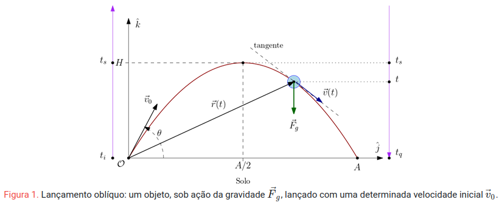

# Lançamento Oblíquo - Jogo em Unity

## Descrição

Este é um jogo desenvolvido na Unity que simula o lançamento oblíquo de projéteis, permitindo que o jogador ajuste parâmetros físicos como a massa do projétil, a velocidade de lançamento e o coeficiente de arrasto para alcançar um alvo. Cada fase apresenta desafios únicos, como diferentes ambientes (ar ou água) e propriedades físicas variadas, oferecendo um cenário dinâmico e envolvente para os jogadores.

[Link para jogar :)](https://pedr-lunkes.itch.io/as-aventuras-fisicas-de-magomerindo)
---
## Mecânicas de Jogabilidade

### **Parâmetros Ajustáveis**

1. **Velocidade Inicial ($v_0$)**: Define a força aplicada ao projétil. Jogadores podem aumentar ou diminuir a velocidade inicial para ajustar a distância que o projétil percorre.
   
2. **Ângulo de Lançamento ($\theta$)**: Afeta diretamente a trajetória parabólica. Jogadores precisam encontrar o ângulo ideal para atingir o alvo com precisão.

3. **Massa do Projétil ($m$)**: Jogadores podem experimentar com projéteis leves e pesados, ajustando sua estratégia conforme a inércia e a gravidade afetam a jogabilidade.

4. **Ambiente (Ar ou Água)**: Em fases subaquáticas, o coeficiente de arrasto simula a resistência do meio. O projétil desacelera mais rapidamente, exigindo maior precisão nos ajustes iniciais.

---

## Física Aplicada ao Jogo

O jogo implementa a simulação física do **lançamento oblíquo**, baseada nas leis clássicas da mecânica de Newton.

No lançamento oblíquo, consideramos um projétil de massa $$( m \)$$, lançado com uma velocidade inicial $$\vec{v_0}$$, fazendo um ângulo $$( \theta \)$$ com o solo (eixo $$( Y \)$$). A trajetória descrita pelo projétil é parabólica devido à influência da gravidade $$( \vec{F}_g \)$$, cuja força é vertical e dirigida para baixo.

### Sistema de Coordenadas

Para simplificar os cálculos, colocamos o lançamento no plano $$( YZ \)$$, onde:
- O eixo $$( Z \)$$ é perpendicular ao solo e representa o movimento vertical.
- O eixo $$( Y \)$$ está sobre o solo e representa o movimento horizontal.

A origem $$\vec{r_t}$$ é definida como o ponto inicial do lançamento, com $$( t_i = 0 \)$$.

---

### Vetores em Coordenadas

No sistema $$( YZ \)$$, descrevemos os vetores posição, velocidade e aceleração do projétil da seguinte forma:

1. **Gravidade**:

$$
\vec{F}_g = -mg\hat{k}, \quad g = 9,8 \, \text{m/s}^2
$$

2. **Posição**:

$$
\vec{r}(t) = x(t)\hat{i} + y(t)\hat{j} + z(t)\hat{k}
$$

3. **Velocidade**:

$$
\vec{v}(t) = \dot{x}(t)\hat{i} + \dot{y}(t)\hat{j} + \dot{z}(t)\hat{k}
$$

4. **Aceleração**:

$$
\vec{a}(t) = \ddot{x}(t)\hat{i} + \ddot{y}(t)\hat{j} + \ddot{z}(t)\hat{k}
$$

---

### Segunda Lei de Newton

Pela segunda lei de Newton, temos:

$$
\vec{F} = m \vec{a}
$$

Substituindo a gravidade como única força atuante:

$$
-mg\hat{k} = m \ddot{x}(t)\hat{i} + m \ddot{y}(t)\hat{j} + m \ddot{z}(t)\hat{k}
$$

Dividindo por \( m \) e comparando as componentes dos vetores:

$$
\ddot{x}(t) = 0, \quad \ddot{y}(t) = 0, \quad \ddot{z}(t) = -g
$$

Essas equações diferenciais descrevem a aceleração em cada eixo.

---

### Solução das EDOs

Resolvendo as EDOs para \( x(t) \), \( y(t) \) e \( z(t) \):

1. Para \( x(t) \):

$$
\ddot{x}(t) = 0 \implies \dot{x}(t) = c_1 \implies x(t) = c_1 t + c_2
$$

Condições iniciais: \( x(0) = 0 \) e \( \dot{x}(0) = 0 \):

$$
c_1 = 0, \, c_2 = 0 \implies x(t) = 0
$$

2. Para \( y(t) \):

$$
\ddot{y}(t) = 0 \implies \dot{y}(t) = c_3 \implies y(t) = c_3 t + c_4
$$

Condições iniciais: \( y(0) = 0 \) e \( \dot{y}(0) = v_0 \cos(\theta) \):

$$
c_3 = v_0 \cos(\theta), \, c_4 = 0 \implies y(t) = v_0 \cos(\theta) t
$$

3. Para \( z(t) \):

$$
\ddot{z}(t) = -g \implies \dot{z}(t) = -g t + c_5 \implies z(t) = -\frac{1}{2} g t^2 + c_5 t + c_6
$$

Condições iniciais: \( z(0) = 0 \) e \( \dot{z}(0) = v_0 \sin(\theta) \):

$$
c_5 = v_0 \sin(\theta), \, c_6 = 0 \implies z(t) = v_0 \sin(\theta) t - \frac{1}{2} g t^2
$$

---

### Equações Finais

As equações horárias que descrevem a posição são:

$$
x(t) = 0, \quad y(t) = v_0 \cos(\theta) t, \quad z(t) = v_0 \sin(\theta) t - \frac{1}{2} g t^2
$$

As componentes da velocidade:

$$
v_x(t) = 0, \quad v_y(t) = v_0 \cos(\theta), \quad v_z(t) = v_0 \sin(\theta) - g t
$$

Módulo da velocidade:

$$
|\vec{v}(t)| = \sqrt{v_y^2 + v_z^2} = \sqrt{v_0^2 - 2 v_0 \sin(\theta) g t + (g t)^2}
$$

---

## Estratégias Baseadas na Física

Para dominar o jogo, os jogadores devem aplicar conceitos de física ao ajustar os parâmetros:

1. **Máximo Alcance Horizontal**: Para alcançar o maior alcance possível, o ângulo de lançamento deve ser próximo de $45^\circ$, em ambientes sem arrasto.

2. **Trajetória Precisa em Ambientes Resistivos**: Fases que incluem resistência do ar ou água exigem um lançamento mais direto, com ângulos menores ($<45^\circ$) para compensar a desaceleração.

3. **Controle da Massa**: Em fases com obstáculos, usar projéteis mais pesados pode ajudar a manter uma trajetória mais estável, enquanto projéteis leves são ideais para atingir alvos em áreas de difícil acesso.

---
## Movimento no Campo Gravitacional

O movimento do projétil é regido pela gravidade e segue uma trajetória parabólica quando o coeficiente de arrasto é desprezado. As equações clássicas são implementadas para calcular a posição e a velocidade do projétil em tempo real:

#### **Movimento Horizontal**
A posição horizontal é descrita por:

$$
z(t) = v_0 \cdot \cos(\theta) \cdot t
$$

- $v_0$: velocidade inicial.
- $\theta$: ângulo de lançamento.
- $t$: tempo.

#### **Movimento Vertical**
A posição vertical, que inclui o efeito da gravidade, é dada por:

$$
z(t) = v_0 \cdot \sin(\theta) \cdot t - \frac{1}{2} g t^2
$$

- $g$: aceleração gravitacional ($9,81 \, m/s^2$ na Terra).

A velocidade vertical muda com o tempo devido à gravidade:

$$
v_z(t) = v_0 \cdot \sin(\theta) - g \cdot t
$$
## Alcance Máximo e Trajetória

1. O alcance máximo ocorre para $$( \theta = \frac{\pi}{4} \)$$ (ou $$\( 45^\circ \))$$, onde a derivada do alcance em função de $$\( \theta \)$$ é zero.

2. A trajetória é uma parábola no plano $$\( YZ \)$$, conforme descrito pelas equações acima.

---

Essas deduções podem ser aplicadas diretamente ao jogo, validando os cálculos de trajetória e comportamento físico do projétil para diferentes condições ajustadas pelo jogador.
## Massa do Projétil

No jogo, o jogador pode ajustar a massa do projétil, que afeta sua aceleração conforme a segunda lei de Newton:

$$
F = m \cdot a
$$

Isso significa que projéteis mais leves podem ser lançados mais facilmente, mas são mais suscetíveis a forças externas (como arrasto), enquanto projéteis mais pesados mantêm sua inércia, mas têm trajetórias mais curtas devido à gravidade.
## Coeficiente de Arrasto

Embora o jogo não calcule explicitamente a força de arrasto, ele permite ajustar um parâmetro simplificado que simula a resistência do ar ou da água. Isso afeta a desaceleração do projétil e altera a sua trajetória, proporcionando um desafio adicional nas fases que incluem obstáculos como vento ou água.

---

## Cálculo da Velocidade no Instante \( t \)

Para calcular a velocidade do objeto no instante \( t \), utilizamos o **método de Euler**, uma técnica numérica para aproximar soluções de equações diferenciais ordinárias (EDOs). A equação diferencial que rege o movimento é:

$$
\vec{a}(t) = \frac{d\vec{v}(t)}{dt},
$$

onde $$\vec{a                                                                                                                                                                                                                                                                                           }$$ é a aceleração no instante \( t \) e $$\vec{v}$$ é a velocidade.

Aplicando o método de Euler, a velocidade no instante \( t + $$\Delta$$ t \) é calculada como:

$$
\vec{v}(t + \Delta t) = \vec{v}(t) + \vec{a}(t) \cdot \Delta t,
$$

onde:
- $$\Delta$$ t é o intervalo de tempo entre as iterações (DeltaTime no Unity, que mede o tempo entre os frames renderizados),
- $$\vec{v}$$ é a velocidade conhecida no instante atual,
- $$\vec{a}$$ é calculada com base nas forças atuantes no objeto.
Essa abordagem permite uma atualização iterativa da velocidade em cada passo de tempo, sendo eficiente e suficientemente precisa para os objetivos do jogo.

## Tecnologias Utilizadas

- **Engine**: Unity 2023.x.
- **Linguagem**: C#.
- **Movimento de Projetéis**: Física 2D
## Referências

1. **Notas de Aula** - dinamica-v4.pdf
2. **Método de Euler** - Wikipedia
3. [**Unity Documentation**](https://www.google.com/url?sa=t&source=web&rct=j&opi=89978449&url=https://docs.unity.com/&ved=2ahUKEwjP8-a914uKAxUeqZUCHS1oBuwQFnoECA0QAQ&usg=AOvVaw1tl3GibVO-rZ_iA7vfnovN)

## Autores

| Nome                                |
|:-----------------------------------:|
| Dante Brito Lourenço                |
| Frederico Scheffel Oliveira         |
| João Gabriel Pieroli da Silva       |
| Laura Fernandes Camargos            |
| Leonardo Massuhiro Sato             |
| Nicolas Amaral dos Santos           |
| Pedro Henrique de Sousa Prestes     |
| Pedro Henrique Perez Dias           |
| Pedro Lunkes Villela                |
