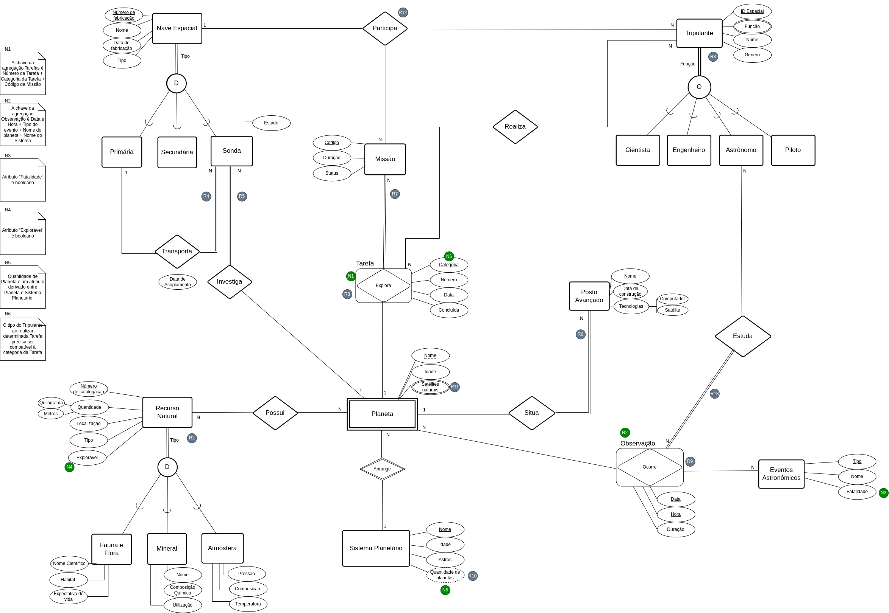

# PlanetDATA 
Neste projeto, desenvolvemos um sistema de banco de dados para uma aplicação externa para Exploração de Planetas, que simula uma exploração de planeta(s), neste ou em outro sistema solar.


## Tecnologias 
**Python3** - Para fazer o protótipo que acessa a API do SGBDR<br>
**Oracle Database** - Sistema de gerenciamento de banco de dados, utilizado para confecção de tabelas e consultas

## Executando a aplicação
### Bibliotecas necessárias:
cx_Oracle<br><br>
Para instalar essas bibliotecas usando o pacote `python`, você pode executar o seguinte comando:

```
python -m pip install cx_Oracle --upgrade
```
[documentação da biblioteca em caso de dúvidas](https://cx-oracle.readthedocs.io/en/latest/user_guide/installation.html)

### Para obter as bibliotecas:

[Se o seu banco de dados estiver em um computador remoto, faça o download e descompacte as bibliotecas do client a partir do pacote gratuito Oracle Instant Client "Basic" ou "Basic Light" para a arquitetura do seu sistema operacional](https://www.oracle.com/database/technologies/instant-client.html)

# Modelo Entidade Relacionamento


# Modelo Relacional


### Autores

|        Nome                         |    NUSP   |       
|:-----------------------------------:|:---------:|
|    Júlio Cesar Cabral               |  13672922 |  
|   Laura Fernandes Camargos          |  13692334 |   
|   Lucas Masaki Maeda                |  13692272 |  
|   Matheus Henrique da Silva         |  13696658 |    
|   Luís Henrique Hergesel Lima       |  13692341 |   

